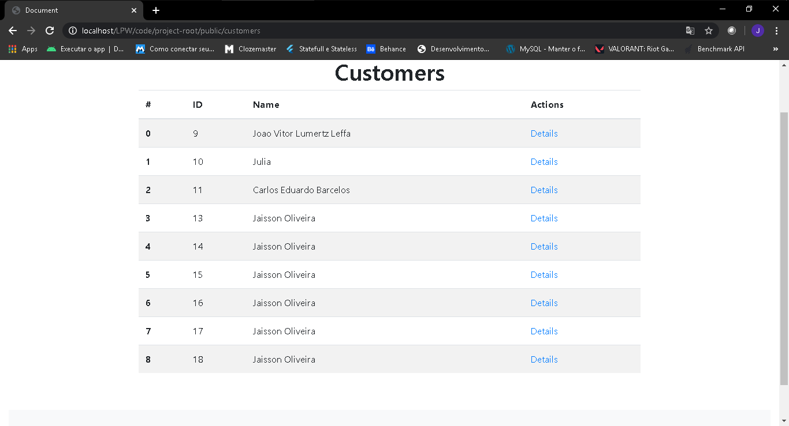
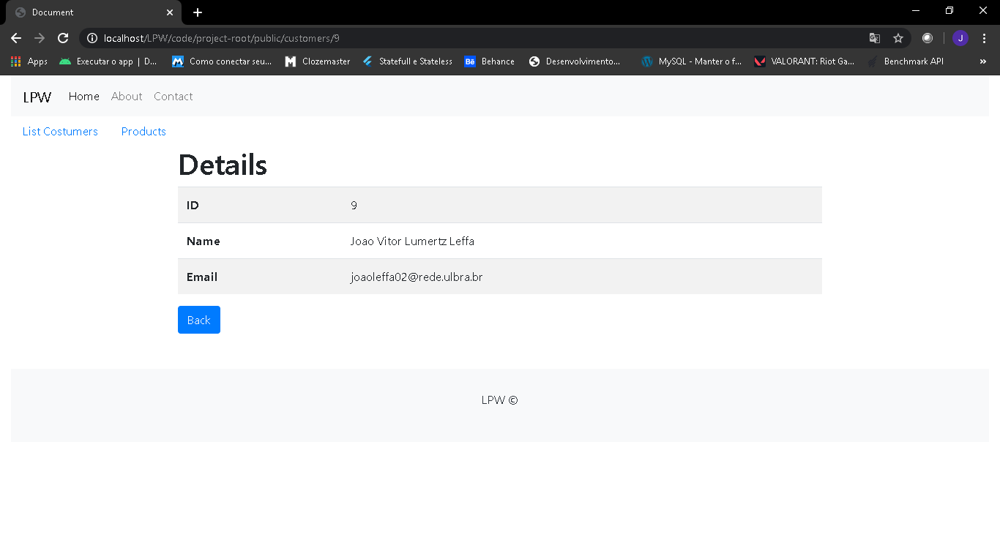
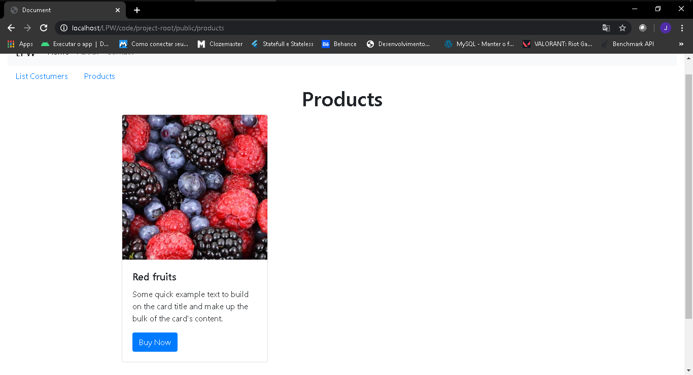

## Implementacao do projeto [CRUD em PHP](https://github.com/joaovitorleffa/Programacao-Web-PHP) puro
### Estrutura MVC
O CodeIgniter possibilita a construcaoo de aplicacoes de formas simples e rápida. Consegui ver isso na pratica realizando esse pequeno projeto.
### Pages
#### Home

#### Customers

#### Details Customers

#### Products

