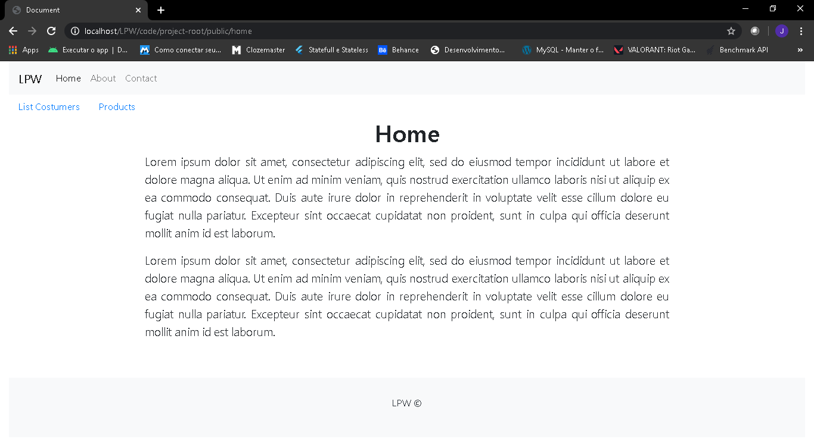

##1. Implementa��o do projeto [CRUD em PHP](https://github.com/joaovitorleffa/Programacao-Web-PHP) puro
###1.1 Estrutura MVC
O CodeIgniter possibilita a constru��o de aplica��es de formas simples e rápida. Consegui ver isso na pr�tica realizando esse pequeno projeto.
###1.2 Pages
####1.2.1 Home

####1.2.2 Customers

####1.2.3 Details Customers

####1.2.4 Products
